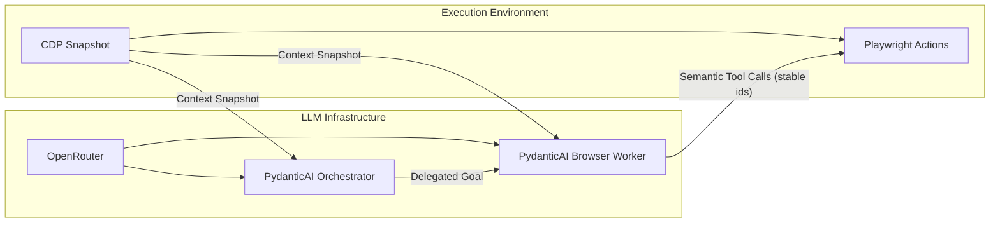
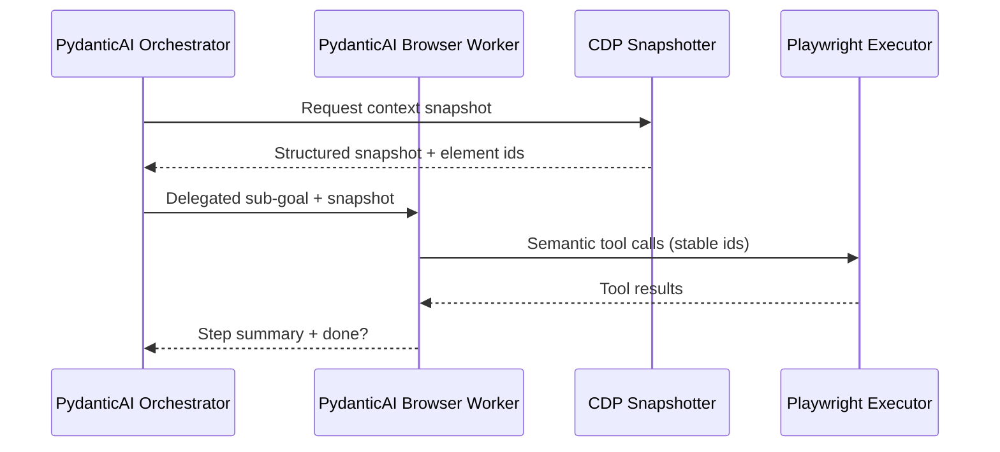

# computer-use-perf

General-purpose browser agent (scaffold).

## Structure
- Entry point: `main.py`
- Core modules: `src/agent/`

## Setup
- `uv sync`
- Set `OPENROUTER_API_KEY` for OpenRouter access

## Run
- `uv run main.py --url <target> --goal "<task>" [--headless] [--log-level INFO] [--no-metrics]`

### Outputs
- Logs: `logs/agent.log`
- Metrics (JSONL): `logs/metrics.jsonl` (timings, token usage, and OpenRouter cost when available)
- Run summary: `logs/run_summary.json`
- Details: `docs/observability.md`

## Architecture

This project is a general-purpose browser agent built around a clear separation of concerns:

- **PydanticAI** handles orchestration, memory, and structured outputs.
- **OpenRouter** provides a single OpenAI-compatible gateway to multiple model providers.
- **CDP** captures rich DOM context for the LLM.
- **Playwright** executes actions reliably in the browser.

### Agent Framework (PydanticAI)

- Agents are defined with `Agent(model, tools=...)` and return structured outputs.
- Pydantic models describe the agent outputs and tool payloads.
- Multi-agent orchestration is handled manually via code-driven delegation.

### LLM Infrastructure (OpenRouter)

- OpenRouter is used as an OpenAI-compatible endpoint.
- Models (Groq, Cerebras, OpenAI, etc.) are selected via model names.
- Structured outputs are enforced via JSON schema when supported.

### Execution Environment

- **CDP (Chrome DevTools Protocol)** is used for context extraction:
  - DOM, accessibility, layout, and element metadata for LLM context.
  - Low-latency, high-fidelity snapshots.
- **Playwright** is used for action execution:
  - Robust actions with built-in waiting and retries.
  - Browser lifecycle and session management.
- **CDP + Playwright via CDPSession** keeps context extraction and actions aligned.

## Tooling Principles

### Semantic Tools (Preferred)

The agent uses semantic tools that reference stable element IDs:

- `click_element(element_id: str)`
- `type_text(element_id: str, text: str)`
- `drag_and_drop(source_id: str, target_id: str)`
- `select_all()`, `copy_selection()`, `paste()`
- `read_element_text(element_id: str)`
- `switch_to_iframe(iframe_id: str)`, `switch_to_main_frame()`
- `navigate_to(url: str)`, `take_screenshot()`

### Reference-Based, Not Selectors

- The LLM never sees raw CSS/XPath selectors.
- Each snapshot produces a mapping: `stable_id -> backend node id + frame metadata` (internal only).
- Tool calls only accept stable element IDs.

### Optional Escape Hatches

- `execute_js(code: str)`
- `press_key_combination(keys: list[str])`

## Recommended Agent Loop

1. **Extract context via CDP** into a structured snapshot.
2. **Ask the orchestrator** for the next delegated sub-goal.
3. **Ask the browser worker** to execute that sub-goal using semantic tools.
4. **Update memory + stop criteria** (`done` or `max_steps`).
5. **Repeat** until the overall goal is complete.

## Guardrails

- Avoid hardcoding site-specific selectors or strings.
- Pass stable element IDs, never raw selectors, to the LLM.
- Keep tools generic and reusable across websites.

## Roadmap

### Phase 1: Scaffolding (Done)

- Create modular package layout under `src/agent/`.
- Replace legacy docs with updated architecture guidance.
- Define basic config and entrypoint.

### Phase 2: Context & Tooling (Done)

- Implement CDP snapshot capture for DOM + accessibility.
- Create hashed stable element-id mapping per snapshot (CDP node IDs stay internal).
- Wire semantic tools to Playwright/CDP actions with overlay-aware input.
- Support iframe switching and navigation APIs with frame-aware CDP sessions.

### Phase 3: Agent Loop (Done)

- Add an orchestrator agent that delegates to worker agents.
- Implement a browser worker agent with tool-calling support.
- Build an orchestration loop with memory and stop criteria.

### Phase 4: Quality & Reliability

- Add tests for snapshot extraction, id mapping, and tools.
- Add logging and tracing for agent decisions.
- Create replay fixtures for debugging.
