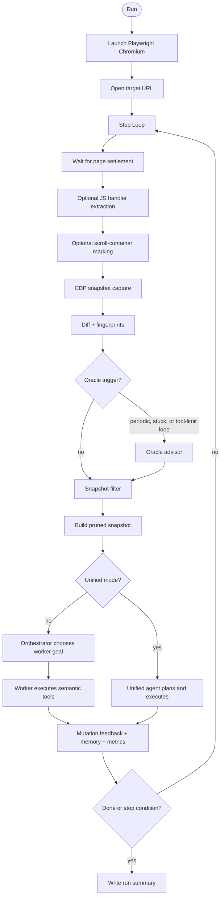

# computer-use-perf

`computer-use-perf` is an experimental browser agent focused on making LLM-driven web automation reliable, inspectable, and measurable.

The project started as a custom Playwright plus LLM harness and evolved into a modular browser-agent runtime with CDP snapshots, stable element IDs, DOM-first tools, multi-agent control, and per-run observability.

## What This Is

- A general-purpose browser agent runner for arbitrary web targets.
- A research/engineering artifact for browser-agent reliability patterns.
- A benchmark history from development against an external browser-agent challenge site.
- A collection of debugging scripts, logs, metrics, and architecture notes from iterative development.

## Status

The original external benchmark site used during development may no longer be reliably available. The benchmark results in this repository should be treated as archived historical runs, not as a currently reproducible public benchmark.

The agent itself is not tied to that site. It runs against a target URL and a task file:

```bash
uv run main.py --url <target-url> --task TASK.md
```

## Why Browser Agents Are Hard

Browser automation fails in ways that are easy to miss from a raw screenshot or simple DOM dump:

- Hidden DOM and `data-*` attributes can contain task-critical values.
- Interactive elements can be unlabeled, dynamically inserted, or hidden inside iframes.
- Visual visibility checks can fail because overlays, modals, or z-index layers obscure targets.
- Element labels can be decoys, stale, or unrelated to the actual page task.
- Buttons can transition from disabled to enabled without obvious text changes.
- LLM agents can repeat failed actions, declare success too early, or exhaust tool calls.
- Tool feedback can become large enough to create token and cost blowups.

This project explores those problems as systems problems: context extraction, action semantics, feedback loops, state tracking, and observability.

## Architecture

The current default runtime is a modular loop. `main.py` builds runtime configuration and calls `BrowserAgent.run()` in `src/agent/core/agent.py`.



Key components:

- **Snapshot capture:** `src/agent/context/snapshot.py` uses CDP `DOMSnapshot.captureSnapshot`, `Accessibility.getFullAXTree`, and `Page.getFrameTree`.
- **Handler hints:** `src/agent/context/handlers.py` extracts inline, React, Vue, and Angular handler summaries before snapshot capture.
- **Filter:** A conservative LLM pruner that keeps likely useful elements and high-signal text.
- **Oracle:** A diagnostic advisor called periodically, when stuck, or after repeated tool-limit loops.
- **Orchestrator:** A planner that assigns a small outcome-focused goal to the worker.
- **Worker:** A tool-equipped executor that uses stable element IDs from the snapshot.
- **Unified mode:** `--unified` replaces the Orchestrator -> Worker handoff with one tool-equipped agent after Filter/Oracle preprocessing.

## Tools

The default worker tool set is intentionally constrained:

- `click_element(element_id)`
- `hover_element(element_id, duration_ms=2000)`
- `type_text(element_id, text)`
- `drag_and_drop(source_id, target_id)`
- `draw(element_id, path)`
- `scroll(delta_x, delta_y, element_id=None)`
- `wait(milliseconds)`
- `watch_for_text(text, timeout_ms=10000)`
- `switch_to_iframe(iframe_id)`
- `switch_to_main_frame()`
- `press_key_combination(keys)`

Additional tools such as `inspect_element`, `search_page_attributes`, `execute_js`, `take_screenshot`, and `navigate_to` exist in the tool layer but are not part of the default worker tool set.

## Quick Start

Install dependencies:

```bash
uv sync
```

Set an API key for the provider you want to use:

```bash
export OPENROUTER_API_KEY=...
```

Run the agent:

```bash
uv run main.py --url <target-url> --task TASK.md
```

Useful variants:

```bash
uv run main.py --url <target-url> --task TASK.md --headless
uv run main.py --url <target-url> --task TASK.md --unified
uv run main.py --url <target-url> --task TASK.md --provider groq
uv run main.py --url <target-url> --task TASK.md --worker-model <model> --filter-model <model> --oracle-model <model>
uv run main.py --url <target-url> --task TASK.md --save-pages
```

Run tests:

```bash
uv run pytest -q
```

## Outputs

Each run writes to `logs/<run_id>/`; `logs/latest` points to the most recent run.

- `logs/latest/agent.log`: human-readable runtime log.
- `logs/latest/agent_debug.log`: verbose debug log with prompts, structured outputs, diffs, memory, and traces.
- `logs/latest/metrics.jsonl`: structured events for snapshots, agent calls, tools, tokens, cost, and timings.
- `logs/latest/run_summary.json`: final rollup with stop reason, duration, tokens, cost, provider, and models.
- `logs/latest/pages/`: optional saved HTML snapshots when `--save-pages` is enabled.

Analyze timing metrics:

```bash
uv run python scripts/analyze_metrics.py logs/latest/metrics.jsonl
```

Regenerate archived benchmark results:

```bash
uv run python scripts/generate_results.py
```

## Documentation

- `docs/journey.md`: project history from custom harness to modular agent.
- `docs/architecture.md`: current runtime architecture verified against code.
- `docs/failure-modes.md`: browser-agent failure modes and mitigations.
- `docs/benchmark-results.md`: archived benchmark results and interpretation.
- `docs/observability.md`: logs, metrics, and run artifacts.
- `docs/architecture-options.md`: comparison of six agent architecture options.
- `docs/challenge-map.md`: archived challenge-site investigation notes.
- `docs/source-map.md`: where documentation claims come from.
- `docs/articles/`: long-form engineering writeups about the project journey and lessons learned.

## Design Principles

- Prefer DOM-first actions for click/type/read interactions; use coordinates only when the action is inherently spatial, such as drawing or some drag/drop cases.
- Pass stable element IDs to the LLM, never raw CSS or XPath selectors.
- Keep pruning conservative because over-pruning can make a step impossible.
- Treat tool feedback as part of the agent loop, not just logging.
- Separate general-purpose architecture from benchmark-specific fixes.
- Measure tokens, cost, timing, stop reasons, and tool behavior for every run.

## Limitations

- The archived benchmark site may not be available, so historical results may not be independently rerunnable.
- Some benchmark-specific recovery code remains in the runtime loop and should be isolated if the project becomes a reusable package.
- The agent is experimental and can still repeat bad actions, over-trust page text, or fail on complex application state.
- The default worker tool set intentionally excludes powerful escape hatches like arbitrary JavaScript execution.

## Roadmap

- Add a small local demo/mini-benchmark so the repository remains reproducible without the original external benchmark.
- Isolate benchmark-specific fixes from the general runtime.
- Build a simple run viewer for logs, metrics, page captures, and step traces.
- Improve failure classification and result summaries.
- Add more deterministic validation for overall task completion.
