# Agent Architecture Options

This is a historical design review from Zip's architecture work. It compares the split Orchestrator/Worker architecture with five alternatives and is useful for understanding design trade-offs, but `docs/architecture.md` is the authoritative description of the current runtime.

---

## Option A: Split Orchestrator + Worker Architecture

**Pattern**: Two-agent planner-executor with auxiliary Oracle and Filter agents.

The split design uses four LLM-powered agents in a serial pipeline within each step. The **Orchestrator** is a pure planning agent with zero tools — it receives the full context (goal, memory, diff, oracle hint, pruned snapshot) and produces a `worker_goal` string. The **Worker** is a tool-equipped executor that receives the delegated goal plus compact recent state, useful text lines, and the pruned snapshot, then makes bounded sequential tool calls against the browser.

### How It Works

Each step follows a strict sequence:

1. **Snapshot Capture**: CDP calls (`DOMSnapshot.captureSnapshot`, `Accessibility.getFullAXTree`, `Page.getFrameTree`) produce a `PageSnapshot` containing all interactive elements with stable IDs, handler hints, and accessibility properties.

2. **Diff + Fingerprinting**: The snapshot is compared against the previous step's snapshot. A `page_fingerprint` (SHA-256 of URL + title + element fingerprints + raw text) drives the filter cache. A separate `progress_fingerprint` (ignores `stable_id` churn) drives stuck detection.

3. **Oracle** (conditional — every N steps or when stuck): Receives the overall goal, the execution trace (last 15 steps with URL/goal/summary/diff-stats), and the full unpruned snapshot. Outputs `OracleAdvice` with `all_clear`, `diagnosis`, `recommendation`, and `avoid` list. When `all_clear=false`, it builds an `oracle_hint` string, invalidates the filter cache, and extracts `avoid_ids` that get excluded from the pruned snapshot.

4. **Filter** (conditional — on page fingerprint change or cache miss): Receives the goal, last worker goal, last summary, diff, oracle hint, full snapshot, and raw text lines. Outputs `SnapshotFilterOutput` with `useful_text_lines` and `priority_element_ids`. These IDs form the basis of the pruned snapshot. The filter is the most token-expensive agent (sees ALL elements) but its output is cached by page fingerprint.

5. **Pruning**: Builds a `pruned_snapshot` from `priority_ids - avoid_ids`, expands to include sibling elements within semantic containers (forms, sections, navs), caps expansion at 80 additional elements.

6. **Orchestrator**: Receives goal, useful lines, diff, memory (last 10 entries), worker tool list, pruned snapshot (sorted by `query=(useful_lines + prev_goal)[:600]`), and oracle hint. Returns `OrchestratorDecision`:
   ```python
   class OrchestratorDecision(BaseModel):
       done: bool        # True = overall goal complete → BREAK the run loop
       worker: Literal["browser"]
       worker_goal: str  # The sole communication channel to the Worker
       rationale: str | None
   ```
   The Orchestrator prompt (`ORCHESTRATOR_PROMPT`) instructs it to "describe the desired outcome, not the method" and to "always reference stable element IDs." These two rules are somewhat in tension — it must be outcome-focused but also specific enough to include element IDs.

7. **Worker**: Receives `STEP_PROMPT.format(goal=worker_goal)` + compact recent state + useful text lines + pruned snapshot (re-sorted by `query=worker_goal[:600]`). Makes bounded sequential tool calls from the semantic browser tool set documented in `README.md` and `docs/architecture.md`. Each tool call goes through `semantic.py`, which injects a MutationObserver before the action and returns DOM change feedback. Returns `StepOutput`:
   ```python
   class StepOutput(BaseModel):
       done: bool  # True = sub-goal complete (does NOT stop the run)
       summary: str
   ```

8. **Done-Gate**: If the Worker claims `done=true` but had zero successful tool calls, the done is overridden to false. This prevents hallucinated success.

9. **Memory + Trace Update**: A memory entry like `[step 3, 2 ok, 0 failed] Clicked submit and saw confirmation` is appended. A structured trace entry (step, url, goal, summary, diff_summary, url_changed) is appended for the Oracle.

### The Handoff Bottleneck

The core Orchestrator-to-Worker communication is a single `worker_goal` string. The Worker does **not** receive the full planning context:
- Full diff context (what changed since last step)
- Full Oracle hint (diagnostic advice)
- The Orchestrator's rationale
- Full memory
- The avoid list except as reflected indirectly via the pruned snapshot

This means the Orchestrator must encode all strategic context into a goal string like: "Click the submit button el_abc123 to complete the registration form." Any nuance about what to avoid, what changed, or why this goal was chosen is lost.

### Failure Modes

- **Orchestrator premature done**: The Orchestrator can propose `done=true` on any step. Completion policy and BrowserGym validation reduce this risk, but weak validation can still stop a run too early.
- **Goal too large for tool budget**: The Orchestrator sets goals like "Fill in the entire registration form" but the Worker has ~8 effective tool calls (10 request limit includes the initial prompt and final structured output). Complex forms exhaust the budget.
- **Oracle advice not reaching Worker**: The Oracle says "avoid el_xyz, try el_abc instead" but this advice only reaches the Orchestrator as text. The Orchestrator must translate it into the `worker_goal` string. If the Orchestrator doesn't encode it, the Worker is blind to it.
- **Filter over-pruning**: The Filter removes elements the Orchestrator/Worker might need. Since pruning is irreversible within a step, over-pruning makes the task impossible for that step.

### Research Backing

This is the **Agent-E pattern** (Emergence AI, 2024) — the current SOTA on WebVoyager at 73.2%. Agent-E uses AutoGen with a Planner Agent shielded from DOM noise and a Browser Navigation Agent handling low-level interactions. The key insight: insulating the planner from raw DOM complexity improves planning quality.

### Step Pipeline

```mermaid
flowchart TD
    START([Step Start]) --> LOAD[Page Load Wait]
    LOAD --> HANDLERS{Handlers\nenabled?}
    HANDLERS -->|Yes| EXTRACT[Handler Extraction\npage.evaluate]
    HANDLERS -->|No| SNAP
    EXTRACT --> SNAP[Snapshot Capture\nCDP: DOM + A11y + FrameTree]
    SNAP --> DIFF[Diff vs Previous Snapshot]
    DIFF --> FP[Compute Fingerprints\npage_fp + progress_fp]
    FP --> STUCK{progress_fp\nunchanged?}
    STUCK -->|Yes| INC[no_progress_steps++]
    STUCK -->|No| RESET[no_progress_steps = 0]
    INC --> ABORT{no_progress >=\nabort threshold?}
    RESET --> ABORT
    ABORT -->|Yes| STOP([STOP: unchanged abort])
    ABORT -->|No| INDEX[Build element_index\n+ tool_context]
    INDEX --> FULL[Format full_tree_text\nall elements]

    FULL --> ORA_CHK{Oracle trigger?\nperiodic OR stuck}
    ORA_CHK -->|Yes| ORACLE[[Oracle Agent\ndiagnosis + recommendation]]
    ORA_CHK -->|No| FILT_CHK
    ORACLE --> ORA_OK{all_clear?}
    ORA_OK -->|Yes| FILT_CHK
    ORA_OK -->|No| ORA_ACT[Build oracle_hint\nInvalidate filter cache\nExtract avoid_ids]
    ORA_ACT --> FILT_CHK

    FILT_CHK{Filter cache\nvalid?}
    FILT_CHK -->|Hit| PRUNE
    FILT_CHK -->|Miss| FILTER[[Filter Agent\npriority_ids + useful_lines]]
    FILTER --> PRUNE[Build Pruned Snapshot\nkept_ids - avoid_ids\n+ container expansion]

    PRUNE --> ORCH[[Orchestrator Agent\ngoal + memory + diff + snapshot\n+ oracle_hint]]
    ORCH --> DONE_O{done?}
    DONE_O -->|Yes| COMPLETE([STOP: goal complete])
    DONE_O -->|No| WORKER[[Worker Agent\nworker_goal + 3 recent steps\n+ useful_lines + snapshot]]
    WORKER --> TOOLS[Execute Tool Calls\nmax 10 requests, sequential]
    TOOLS --> GATE{done=true AND\nsuccess_count=0?}
    GATE -->|Yes| OVERRIDE[Override done=false]
    GATE -->|No| MEM
    OVERRIDE --> MEM[Update Memory\n+ Step Trace]
    MEM --> NEXT([Next Step])

    style ORACLE fill:#f9e5a8,stroke:#d4a017
    style FILTER fill:#a8d5f9,stroke:#1780d4
    style ORCH fill:#c8a8f9,stroke:#6a17d4
    style WORKER fill:#a8f9b8,stroke:#17d44a
```

### Agent Data Flow

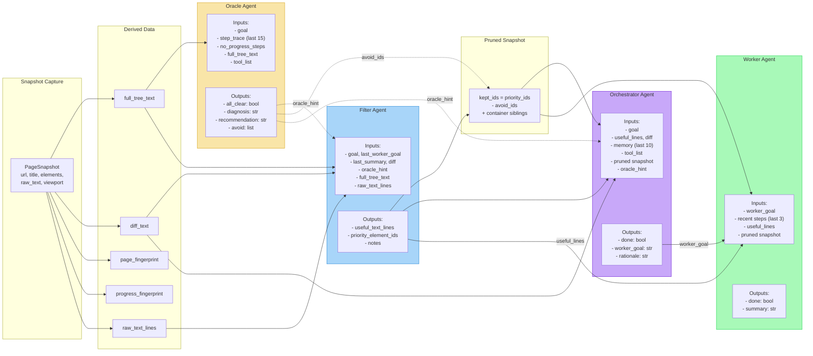

### Characteristics

| Metric | Value |
|--------|-------|
| LLM calls/step | 2-4 (Orchestrator + Worker always; Oracle periodic; Filter on cache miss) |
| Latency/step | 8-40s LLM time |
| Token input/step | ~20,000-45,000 (all agents combined) |
| Done signals | 2 (orchestrator: end run; worker: sub-goal complete) |
| Worker context | worker_goal string + 3 recent steps + pruned snapshot |
| Model flexibility | Yes (separate `--worker-model`, `--filter-model`, `--oracle-model`) |

---

## Option B: Unified Agent (Merge Orchestrator into Worker)

**Pattern**: Single tool-equipped agent that both plans and executes. Oracle and Filter remain unchanged as pre-processing stages.

The core idea is that the Orchestrator is very thin — it produces ~100-300 output tokens for a goal string and a done boolean. Its entire contribution can be absorbed into a single agent that sees the full context AND has browser tools. Instead of two serial LLM calls (plan, then execute), there is one call where the agent reasons about what to do and then does it.

### How It Works

The step pipeline is identical to Option A through the pruning phase. The change is that the Orchestrator and Worker collapse into a single agent:

1. **Pre-processing** (unchanged): Snapshot → Diff → Fingerprint → Oracle (conditional) → Filter (conditional) → Prune.

2. **Unified Agent Call**: A single PydanticAI agent receives ALL context that was previously split:
   - Overall goal (was in Orchestrator only)
   - Memory — last 10 entries (was in Orchestrator only; Worker only saw 3)
   - Diff text (was in Orchestrator only)
   - Oracle hint (was in Orchestrator only)
   - Useful text lines (was in both)
   - Pruned snapshot (was in both, but sorted differently)
   - Browser tools (was in Worker only)

   The agent reasons about the current state, decides what action(s) to take, executes tool calls, and then returns a structured result.

3. **Single Done Signal**: The unified agent's `done=true` means the overall goal is complete. There is no separate "sub-goal done" signal. The run loop breaks on `done=true`.

### What the Prompt Looks Like

The system prompt would merge `ORCHESTRATOR_PROMPT` and `STEP_PROMPT` into a single prompt. Key sections:

- **Planning rules** (from Orchestrator): Use memory to avoid repeating failed approaches. Use diff to detect state changes. Follow Oracle directives.
- **Execution rules** (from Worker): Use minimum tool calls. Never guess values. Use DOM feedback to assess success. Don't repeat failing actions.
- **Done rules**: Set `done=true` only when the overall goal is complete AND at least one tool call succeeded.

The user message would carry: goal + memory + diff + oracle_hint + useful_lines + pruned_snapshot — all in one block.

### Structured Output

```python
class StepResult(BaseModel):
    done: bool       # True = overall goal complete → BREAK
    summary: str     # What happened this step
    rationale: str   # Why these actions were chosen (replaces OrchestratorDecision.rationale)
```

This replaces both `OrchestratorDecision` and `StepOutput`. The `worker_goal` field disappears — the agent self-determines what to do.

### What Changes in the Codebase

- **`build_orchestrator_agent`**: Removed entirely.
- **`build_browser_worker_agent`**: Becomes `build_unified_agent`. System prompt changes to merged prompt. `output_type` changes to `StepResult`.
- **Run loop** (`BrowserAgent.run()`): The ~120 lines handling orchestrator call + retry + done check + worker prompt assembly + worker call collapse into a single `unified_agent.run()` call with full context as the user message.
- **`OrchestratorDecision`**: Removed. `StepOutput` replaced by `StepResult`.
- **`ORCHESTRATOR_PROMPT` + `STEP_PROMPT`**: Merged into a single `UNIFIED_PROMPT`.
- **Snapshot formatting**: Only one `format_snapshot_for_llm()` call per step instead of two (no need for separate orchestrator vs worker ranking).
- **Memory windowing**: The unified agent sees all 10 memory entries (no more 3-entry worker limit).
- **Done-gate**: Simplified — same logic but only one done signal.

### Failure Modes

- **Role confusion**: The agent may over-plan when it should act (spending tokens reasoning instead of clicking), or act impulsively without planning (clicking the first element that looks relevant). The merged prompt must carefully balance "think before acting" with "execute efficiently."
- **Larger prompt may degrade quality on weaker models**: The combined context (goal + memory + diff + oracle + useful lines + snapshot + tool descriptions) is larger than either individual prompt. Models with smaller effective context windows may lose focus.
- **Premature done (inherited)**: Same risk as Option A — the agent can declare done without validation.
- **Lost model flexibility**: Cannot use a cheap model for planning and an expensive model for execution.

### Research Backing

This is the dominant pattern in production browser agent frameworks: **Browser-Use**, **LaVague**, and **Skyvern** all use a single agent with tools in a step loop. It is simpler and lower-latency than planner-executor, but benchmarks show slightly lower accuracy on complex tasks (research estimates ~50-55% vs 55-65% for separated architectures on WebArena-class tasks).

### Step Pipeline

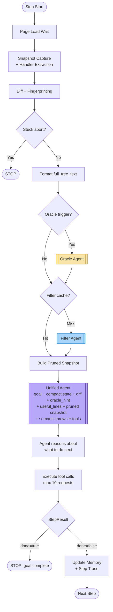

### Agent Data Flow

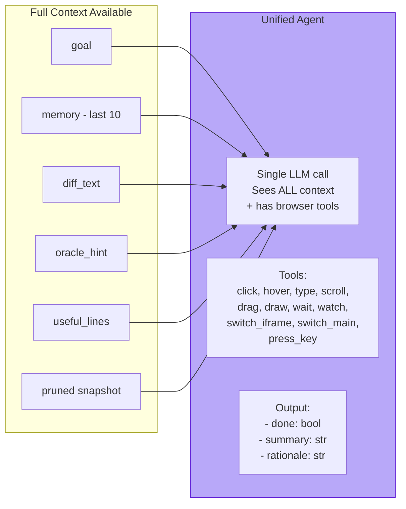

### What Changes (Before/After)

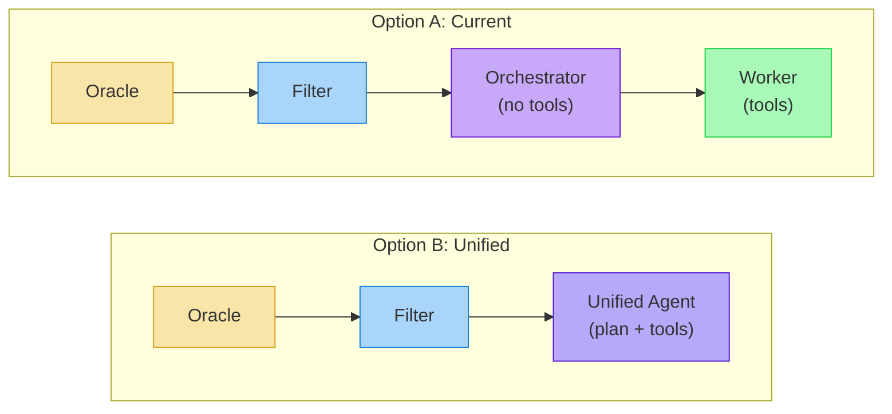

### Characteristics

| Metric | Value |
|--------|-------|
| LLM calls/step | 1-3 (Unified always; Oracle periodic; Filter on cache miss) |
| Latency/step | ~40-50% reduction vs Option A |
| Token input/step | ~15,000-30,000 (fewer agents, but unified prompt is larger) |
| Done signals | 1 (done = overall goal complete) |
| Agent context | Full: goal + memory + diff + oracle_hint + useful_lines + snapshot |
| Model flexibility | No (single model for planning + execution) |
| Implementation effort | 2-3 days |

---

## Option C: Unified Agent with Think-then-Act Structure

**Pattern**: Same as Option B (single agent with tools) but with an enforced planning phase before action execution via structured output design.

The concern with Option B is that a single agent may skip planning and act impulsively. Option C addresses this by requiring the agent to produce an explicit plan as part of its structured output. The plan is logged and can be inspected for debugging, partially recovering the debuggability lost by merging.

### How It Works

The mechanical flow is identical to Option B through the unified agent call. The difference is in the agent's internal behavior, enforced via prompt and output structure:

1. **Think Phase**: Before making any tool calls, the agent must reason about:
   - What has changed since the last step (using diff and memory)
   - What the Oracle directive says (if present)
   - What elements are relevant and why
   - What the expected outcome of the planned actions is
   This reasoning is captured in a `plan` field that the model produces before tool calls.

2. **Act Phase**: The agent executes tool calls based on its plan. Same 10-request limit, same sequential execution.

3. **Assess Phase**: After tool execution, the agent produces the final structured output including a summary of what happened and whether the overall goal is done.

### Structured Output

```python
class StepResult(BaseModel):
    plan: str             # What the agent intends to do and why (forced planning)
    overall_done: bool    # True = overall goal complete → BREAK
    step_summary: str     # What actually happened
    plan_for_next: str    # Hint for the next step (feeds into memory)
```

The `plan` field is the key difference from Option B — it forces the model to articulate its reasoning before acting. This is analogous to chain-of-thought prompting but enforced via the output schema rather than prompt instruction alone.

### How the Think-then-Act Structure Is Enforced

Two complementary mechanisms:

1. **Prompt instruction**: The system prompt explicitly says "Before making any tool calls, produce a plan explaining what you will do and why. Reference specific element IDs and expected outcomes."

2. **PydanticAI structured output**: The `plan` field in `StepResult` is required (no default). The model must populate it. However, since PydanticAI returns structured output after tool calls complete, the `plan` field is technically produced at the same time as the summary. To truly enforce think-before-act, the prompt must instruct the model to reason in its tool call sequence — e.g., the first "tool call" could be a `think` pseudo-tool, or the system prompt could use chain-of-thought markers. In practice, strong models (Claude, GPT-4o) tend to reason before acting when instructed, even without mechanical enforcement.

### What Changes vs Option B

- **`StepResult` model**: Adds `plan` and `plan_for_next` fields.
- **System prompt**: Adds explicit "think before you act" instructions with examples of good vs bad plans.
- **Memory entries**: Can include `plan_for_next` from the previous step, giving the agent continuity of strategic thought across steps.
- **Logging**: The `plan` field is logged at INFO level, making it easy to diagnose planning failures vs execution failures.

### Failure Modes

- **Shallow plans**: The model may produce perfunctory plans like "I will click the submit button" to satisfy the schema requirement without actually reasoning. This is the "lazy chain-of-thought" problem — the model fills the field without genuine thought.
- **Plan-action mismatch**: The model articulates a good plan but then executes different actions. Without mechanical enforcement (like a plan-validation step), there's no guarantee the plan matches the actions.
- **Higher output tokens**: The `plan` and `plan_for_next` fields add ~200-400 output tokens per step. Over a 20-step task, this is 4,000-8,000 extra tokens.
- **All Option B failure modes apply**: Role confusion, premature done, no model flexibility.

### Research Backing

The "Plan-and-Act" paper (2025) explicitly studies this pattern, finding that separating strategic thinking from action execution within a single agent improves reliability. The **ADaPT** framework (2024) takes a lighter approach — it only invokes planning when the executor fails, keeping plans short (3-5 steps). Chain-of-thought prompting research consistently shows that forcing models to reason before answering improves accuracy, especially on multi-step tasks.

### Step Pipeline

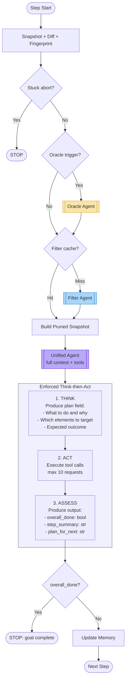

### Structured Output Model

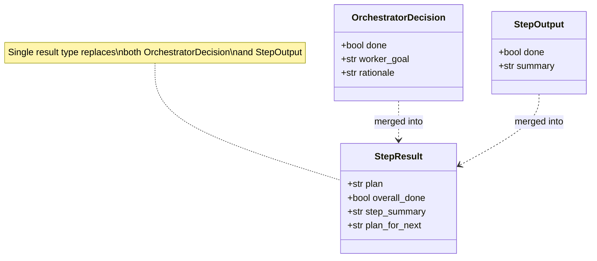

### Characteristics

| Metric | Value |
|--------|-------|
| LLM calls/step | 1-3 (same as Option B) |
| Output tokens | Higher (~300-600 for plan + rationale + summary vs ~100-200 for Option B) |
| Planning quality | Enforced via structured output — agent must articulate plan before acting |
| Debuggability | Better than B — plan field shows reasoning even in unified agent |
| Risk | Model may produce shallow plans to minimize tokens |
| Implementation effort | 2-3 days (same as B, plus prompt tuning for plan quality) |

---

## Option D: ReAct Loop (Fully Flat)

**Pattern**: Single agent in a continuous Reasoning + Acting loop. No step concept, no Oracle, no Filter, no Orchestrator. One agent, one conversation, tools called one at a time with fresh observations after each action.

This is the simplest possible agent architecture and serves as the baseline in most browser agent benchmarks. The agent receives the goal and current page state, makes one tool call, observes the result (including a fresh snapshot), and repeats until done.

### How It Works

1. **Initial Prompt**: The agent receives the overall goal and an initial page snapshot.

2. **Reasoning**: The agent generates a thought about what to do next (optionally visible as chain-of-thought text).

3. **Action**: The agent makes exactly one tool call.

4. **Observation**: After the tool executes, a fresh snapshot is captured and appended to the conversation history as an "observation" message.

5. **Loop**: The agent sees the full conversation history (all prior thoughts + actions + observations) and repeats from step 2.

6. **Termination**: The agent outputs `done=true` or a maximum turn limit is reached.

There is no separate planning step, no filter, no oracle. All intelligence resides in the single agent's ability to reason over its growing conversation history.

### What the Conversation Looks Like

```
System: You are a browser automation agent. [goal + tool descriptions]
User: [initial snapshot]
Assistant: I need to find the login form. Let me click on the Login link.
    → tool_call: click_element(element_id="el_abc123")
Tool: Clicked el_abc123. DOM changes: New form appeared with email and password fields.
User: [new snapshot with login form visible]
Assistant: I can see the login form. Let me type the email.
    → tool_call: type_text(element_id="el_def456", text="user@example.com")
Tool: Typed into el_def456. DOM changes: Input value set.
User: [new snapshot]
...
```

Each turn appends ~3,000-10,000 tokens (snapshot + observation). After 10 actions, the conversation is 30,000-100,000 tokens. After 20, it's 60,000-200,000 tokens. This is the fundamental scalability problem with ReAct.

### What Changes in the Codebase

This is the most disruptive option — it replaces the entire pipeline:

- **All four agent builders removed**: `build_orchestrator_agent`, `build_browser_worker_agent`, `build_snapshot_filter_agent`, `build_oracle_agent`.
- **Run loop**: Completely rewritten. Instead of the per-step pipeline (snapshot → oracle → filter → prune → orchestrate → work), it becomes a tight loop: snapshot → format → append to conversation → call agent → execute tool → repeat.
- **All four model types**: Reduced to one model.
- **Filter/Oracle/Pruning**: Removed entirely. The full snapshot is sent every turn. To manage token cost, you'd need to either truncate the snapshot (losing information) or implement a lightweight sliding-window approach.
- **Memory**: Implicit in the conversation history (no explicit memory list).
- **Stuck detection**: Must be reimplemented as a conversation-level check (e.g., count repeated actions).

### Failure Modes

- **Context explosion**: Token cost grows quadratically with task length. A 20-step task with full snapshots can exceed context limits on most models.
- **Lost-in-the-middle**: Research shows LLMs attend unevenly to long contexts — early and recent tokens get more attention, middle tokens are partially ignored. After 10+ actions, the agent may "forget" what happened in steps 3-7.
- **No external health check**: Without the Oracle, there's no mechanism to detect stuck loops except the agent self-diagnosing, which research (ICLR 2024) shows is unreliable.
- **No DOM filtering**: Every turn sends the full interactive element tree. On complex pages (100+ elements), this wastes tokens on irrelevant elements.
- **Poor long-horizon planning**: The agent makes greedy decisions each turn. Without a high-level plan, it may take locally optimal but globally suboptimal actions (e.g., filling a form top-to-bottom instead of noticing a required prerequisite at the bottom).

### Research Backing

ReAct (Yao et al., 2022) is the foundational pattern. Most browser agent benchmarks use it as the baseline. On **WebArena**, pure ReAct agents achieve ~30-45% success rate. On **WebVoyager**, ~50-60% (but recent "Illusion of Progress" research shows actual rates may be 15-20% lower than reported due to hallucinated success). The pattern works well for short tasks (< 5 actions) but degrades significantly on complex multi-step workflows.

Production frameworks using this pattern: **Browser-Use** (with optimizations like snapshot refs that cut context by 93%), **LaVague** (with a specialized extraction step).

### Architecture

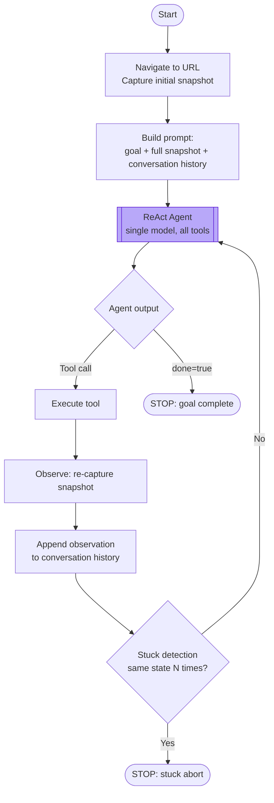

### Comparison with Current

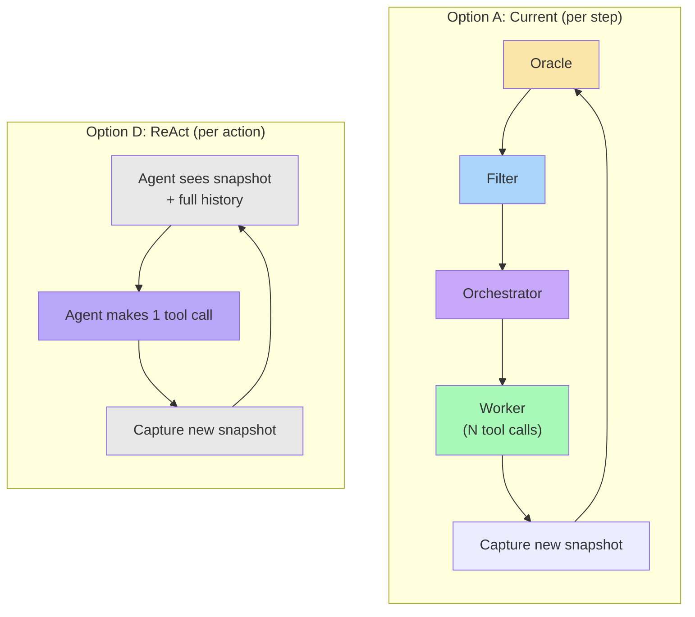

### Characteristics

| Metric | Value |
|--------|-------|
| LLM calls/action | 1 (but one action at a time, not batched) |
| Context growth | Linear per action → quadratic total tokens (each call re-sends history) |
| Oracle/Filter | Removed — must be replaced by prompt engineering or self-reflection |
| Latency/action | Low (~2-5s) but more total calls for same task |
| Token cost for 10-step task | ~150,000-300,000 tokens (vs ~80,000-120,000 for Option A) |
| WebArena success | ~30-45% |
| Implementation effort | 3-4 days (complete rewrite of run loop) |

---

## Option E: Inner/Outer Loop (Magentic-One Pattern)

**Pattern**: The Orchestrator becomes an **outer loop** that plans once and monitors periodically, while the Worker runs **multiple steps autonomously** between re-planning events. The Oracle merges into the outer loop agent (both serve an oversight function).

This is the architecture used by Microsoft's **Magentic-One** (2024), which separates a "Task Ledger" (what needs to be done) from a "Progress Ledger" (what has been done). The key insight: per-step orchestration adds latency without proportional value. Most steps don't need re-planning — the Worker should keep executing until the sub-goal is done, the page state changes dramatically, or progress stalls.

### How It Works

1. **Outer Loop — Plan Phase**: The outer-loop agent (merged Orchestrator + Oracle) receives the overall goal and current page state. It decomposes the goal into a sequence of sub-goals and assigns the first one to the Worker. It also provides strategic guidance: which elements to prioritize, what to avoid, expected page state after the sub-goal completes.

   Output:
   ```python
   class OuterLoopDecision(BaseModel):
       done: bool                # True = overall goal complete
       sub_goals: list[str]      # Ordered list of remaining sub-goals
       current_sub_goal: str     # What the worker should pursue now
       guidance: str             # Strategic context (avoid X, try Y, expect Z)
       avoid_ids: list[str]      # Elements to exclude from worker's snapshot
   ```

2. **Inner Loop — Execute Phase**: The Worker runs autonomously for N steps (or until its sub-goal is done). Each step follows the existing pattern: snapshot → filter → prune → worker agent → memory update. The Worker has richer context than in Option A:
   - The current sub-goal (from outer loop)
   - Strategic guidance (from outer loop, including what was previously oracle-only advice)
   - Diff text (previously orchestrator-only)
   - Avoid IDs (previously only reflected indirectly in pruning)
   - Memory (last 5 entries, up from 3)

3. **Outer Loop — Monitor Phase**: After each Worker step, the run loop checks whether to invoke the outer loop:
   - **Sub-goal done**: Worker declared `done=true` → outer loop re-assesses, assigns next sub-goal or declares overall done.
   - **Periodic check**: Every N Worker steps (e.g., 5), the outer loop checks progress — same as the current Oracle interval.
   - **Stuck detection**: `no_progress_steps >= threshold` → outer loop re-plans, same as the current Oracle stuck trigger.

   The outer loop sees the full step trace, aggregated memory, and the current full snapshot. It can revise sub-goals, change strategy, or declare the overall goal done.

4. **Outer Loop — Re-plan Phase**: When invoked due to stuck/drift, the outer loop functions as a combined Oracle + Orchestrator. It diagnoses what went wrong, revises the sub-goal list, and provides updated guidance. This replaces the current separate Oracle → Orchestrator flow.

### What the Outer Loop Prompt Looks Like

The outer loop prompt merges `ORCHESTRATOR_PROMPT` and `ORACLE_PROMPT`:

```
You are the strategic planner and health monitor for a browser automation agent.

You will be given the overall goal, execution trace, memory, page snapshot, and worker tool list.

Your job:
1. PLAN: Decompose the goal into concrete sub-goals the worker can execute.
2. MONITOR: Assess whether the worker is making progress.
3. DIAGNOSE: If stuck, identify the failure pattern and revise the strategy.
4. DIRECT: Assign the next sub-goal with specific guidance.

[Rules from ORCHESTRATOR_PROMPT + ORACLE_PROMPT merged]
```

### What Changes in the Codebase

- **`build_orchestrator_agent` + `build_oracle_agent`**: Merged into `build_outer_loop_agent`. New output type `OuterLoopDecision`. System prompt is merged Oracle + Orchestrator.
- **`build_browser_worker_agent`**: Enhanced to accept `guidance` and `avoid_ids` directly (not just through pruning). Worker prompt (`STEP_PROMPT`) updated to include guidance block.
- **Run loop**: The main `for step in range(max_steps)` loop now has two modes:
  - **Worker mode** (default): Snapshot → Filter → Prune → Worker. No Orchestrator/Oracle call.
  - **Outer loop mode** (triggered): Snapshot → Full tree → Outer Loop Agent → update sub-goal + guidance → continue in Worker mode.
- **Trigger logic**: A new function `should_invoke_outer_loop(step, no_progress_steps, worker_done)` replaces the current separate Oracle trigger check.
- **`OracleAdvice` + `OrchestratorDecision`**: Merged into `OuterLoopDecision`.
- **Memory**: Worker sees 5 entries (up from 3). Outer loop sees full trace + full memory.

### State Management

New state fields:
```python
@dataclass
class AgentState:
    # ... existing fields ...
    sub_goals: list[str] = field(default_factory=list)  # From outer loop
    current_sub_goal: str = ""                           # Active sub-goal
    guidance: str = ""                                   # Strategic context
    steps_since_outer_loop: int = 0                      # For periodic check
```

### Failure Modes

- **Worker drift**: Without per-step orchestration, the Worker may pursue irrelevant actions for several steps before the outer loop catches it. The periodic check interval (e.g., every 5 steps) is the worst-case detection delay.
- **Sub-goal granularity**: If the outer loop sets sub-goals that are too large, the Worker may exhaust its tool budget without completing them. If too small, the outer loop is called too frequently (degrading back toward Option A).
- **Re-plan thrashing**: If the outer loop keeps revising sub-goals on every invocation (because the page state is genuinely changing rapidly), it adds overhead without stability.
- **Trigger tuning**: The "when to re-plan" heuristic is critical. Too aggressive = Option A latency. Too conservative = Worker drift. The current Oracle triggers (every 5 steps + stuck at 3) are a reasonable starting point, but may need tuning per task complexity.

### Research Backing

**Magentic-One** (Microsoft Research, 2024): Uses a Task Ledger / Progress Ledger separation where the Orchestrator plans once, assigns tasks to specialized agents (WebSurfer, FileSurfer, Coder, Terminal), and re-plans when progress stalls. Achieves competitive results on GAIA, AssistantBench, and WebArena.

The **ADaPT** framework (2024) uses a similar pattern — it only invokes the planner when the executor fails, keeping plans short (3-5 steps) to reduce accumulated error.

**CyberLoop** describes this as the "fast inner loop / slow outer loop" pattern: the inner loop achieves outcomes through direct action, the outer loop enforces strategy and boundaries.

### Architecture

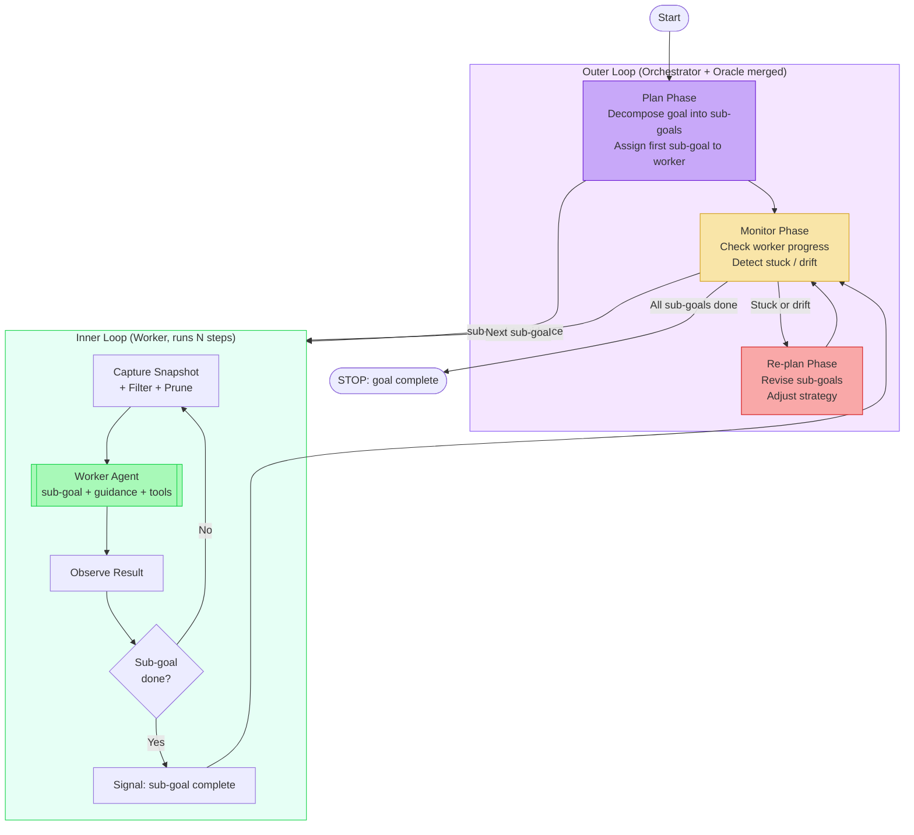

### Outer Loop Trigger Logic

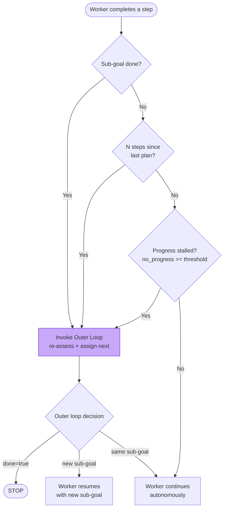

### Data Flow

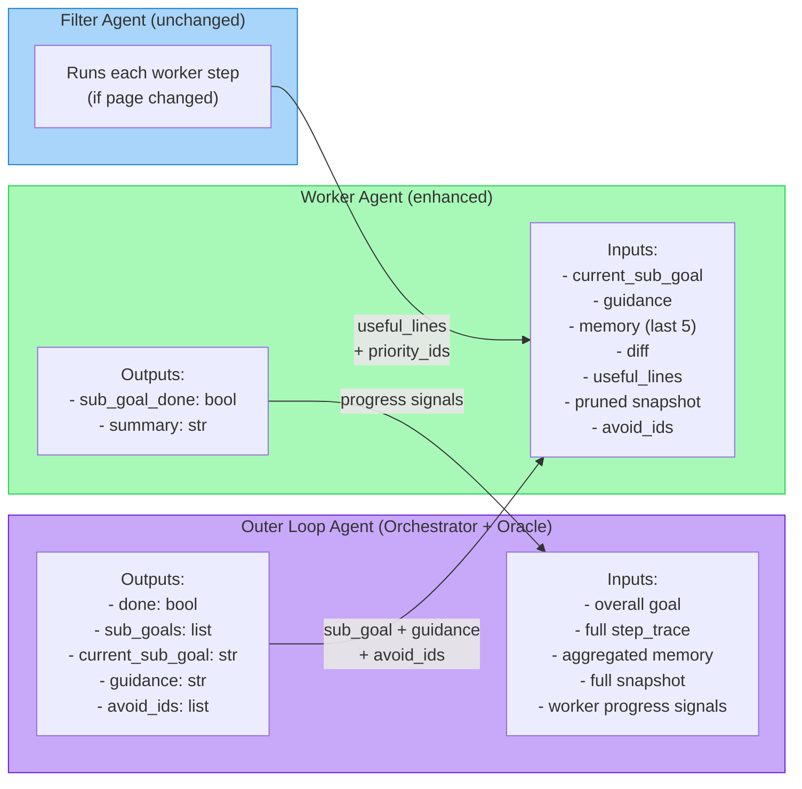

### Characteristics

| Metric | Value |
|--------|-------|
| Outer loop LLM calls | 1 per 3-5 worker steps (amortized) |
| Worker LLM calls/step | 1 (with tools) |
| Net LLM calls for 10-step task | ~12-14 (vs ~20-24 in Option A) |
| Worker autonomy | High — runs multiple steps without re-planning |
| Oracle | Merged into outer loop (same trigger logic) |
| Re-planning | Only on sub-goal completion, periodic check, or stuck |
| Model flexibility | Partial — different models for outer loop vs worker |
| Implementation effort | 3-4 days |

---

## Option F: Tree Search / Backtracking (WebOperator Pattern)

**Pattern**: At each step, the agent proposes multiple candidate actions, speculatively executes each in an isolated browser state, evaluates the outcomes, and commits to the best one. Bad choices are backtracked rather than recovered from.

This is the most computationally expensive architecture but achieves the highest accuracy on benchmarks. The key insight from **WebOperator** (Dec 2024): web environments are partially observable, and greedy step-by-step action selection fails on irreversible actions (clicking "Delete", navigating away from a form, dismissing a one-time dialog). By trying multiple actions and evaluating their outcomes before committing, the agent avoids cascading failures.

### How It Works

1. **State Checkpoint**: Before each action, the agent saves the current browser state. This requires either:
   - **CDP snapshot + restoration**: Save DOM state, cookies, localStorage, form values, and restore them later. Complex and imperfect — some server-side state changes are irreversible.
   - **Browser context cloning**: Launch N parallel browser contexts from the same state. Expensive but more reliable.
   - **Page reload + replay**: Reload the page and replay previous actions to reach the checkpoint state. Slow but deterministic.

2. **Candidate Generation**: A planner agent proposes N candidate actions (e.g., 3). Each candidate is a specific tool call with parameters.

3. **Parallel Evaluation**: Each candidate is executed in an isolated browser context. After execution, a fresh snapshot is captured and an evaluator scores the outcome:
   - Did the page change in a way that advances the goal?
   - Did the action cause an error or unintended side effect?
   - Is the new state recoverable or did the action burn a bridge?

4. **Selection + Commit**: The best-scoring candidate is committed (its browser context becomes the canonical state). Other contexts are discarded.

5. **Backtracking**: If no candidate scores above a threshold, the agent backtracks to the checkpoint state and tries a different approach (with the failed candidates added to an avoid list).

### What the Evaluator Scores

The evaluator agent receives:
- The overall goal
- The pre-action snapshot
- The candidate action that was taken
- The post-action snapshot
- The diff between pre and post

It produces a score (0.0-1.0) based on:
- **Goal progress**: Did the page move closer to the desired state?
- **Reversibility**: Can the action be undone if needed?
- **Side effects**: Did the action cause unexpected changes (new popups, navigation, errors)?

### What Changes in the Codebase

This is the most invasive option:

- **Browser state management**: New module for checkpoint save/restore. Must handle cookies, localStorage, sessionStorage, form state, scroll position, iframe state. Alternatively, manage N parallel browser contexts.
- **Candidate generation agent**: New agent that proposes N actions given the current state. Output: list of `(tool_name, tool_args)` tuples.
- **Evaluator agent**: New agent that scores outcomes. Output: `float` score + reasoning.
- **Run loop**: Each step becomes: checkpoint → generate candidates → fork N contexts → execute each → evaluate each → pick best → commit or backtrack.
- **Existing agents**: Oracle and Filter can remain (Oracle checks long-term progress, Filter prunes for the candidate generator). Or they can be removed in favor of the evaluator.
- **Cost management**: Need configurable N (number of candidates) and a fast-fail threshold to skip evaluation when the first candidate is clearly correct.

### Failure Modes

- **Cost explosion**: With N=3 candidates, each step costs 3x in browser execution + 1 planner + 3 evaluator calls = 7 LLM calls per step (vs 2-4 in Option A). A 10-step task becomes 70 LLM calls.
- **Imperfect state restoration**: Browser state is notoriously hard to save/restore perfectly. Server-side state, WebSocket connections, in-flight animations, and timing-dependent behavior may differ between the original and restored state.
- **Evaluation accuracy**: The evaluator must correctly assess whether an action advances the goal. If the evaluator is inaccurate (which is likely — it's an LLM making a judgment call), the agent may commit to a bad action or backtrack from a good one.
- **Latency**: Even with parallel execution, the step latency is dominated by the slowest candidate + evaluation. With sequential execution, latency is N times a single action.
- **Diminishing returns on easy tasks**: For straightforward tasks (click a clearly labeled button), tree search adds cost without improving accuracy. The overhead only pays off on ambiguous or high-stakes actions.

### Research Backing

**WebOperator** (Dec 2024) achieves **54.56% on WebArena** with GPT-4o — the best published result. It uses action-aware best-first tree search with reliable backtracking. The key innovation: speculative execution with snapshot validation before committing, preventing irreversible mistakes.

**Agent Q** (MultiOn, 2024) combines guided MCTS with self-critique and iterative fine-tuning. **ExACT** uses reflective MCTS with multi-agent debate for state evaluation. **Language Agent Tree Search (LATS)** (2023) established the foundation by combining LLM generativity with MCTS for planning.

The consensus: tree search adds ~15% accuracy over greedy baselines on complex tasks, at 3-5x cost.

### Architecture

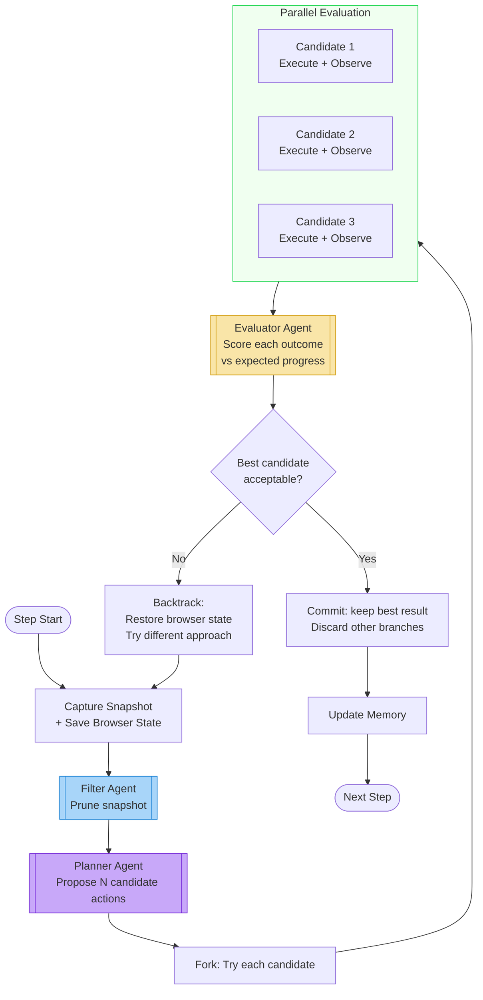

### Greedy vs Tree Search Comparison

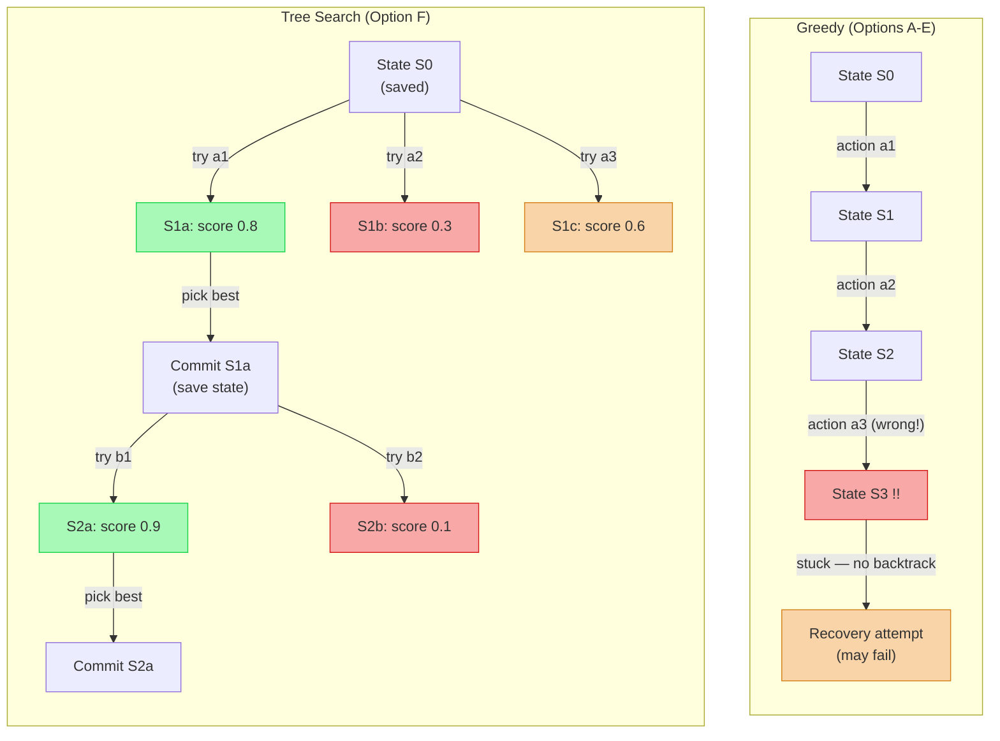

### Characteristics

| Metric | Value |
|--------|-------|
| LLM calls/step | N candidates + 1 planner + N evaluators = 4-7 calls (N=3) |
| Token cost | 3-5x higher than Option A |
| Browser state management | Requires checkpoint save/restore (CDP or page reload) |
| WebArena SOTA | 54.56% (best published, GPT-4o) |
| Latency/step | High (~15-45s even with parallel eval) |
| Accuracy gain | ~+15% over greedy baselines on complex tasks |
| Implementation effort | 1-2 weeks (browser state management is the hard part) |

---

## Side-by-Side Comparison

### LLM Calls per 10-Step Task

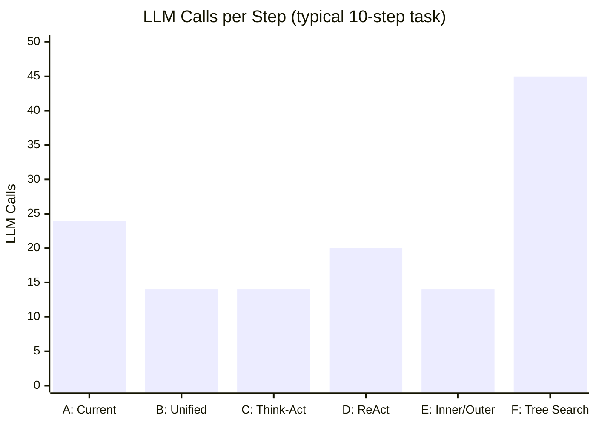

### Architecture Complexity vs Accuracy

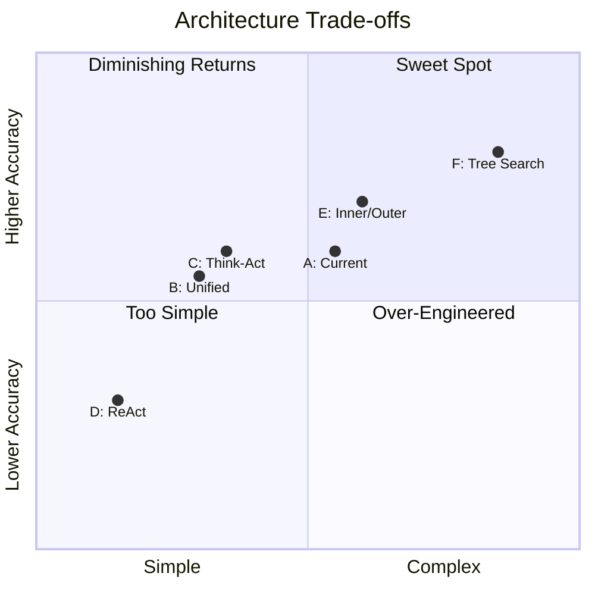

### Decision Matrix

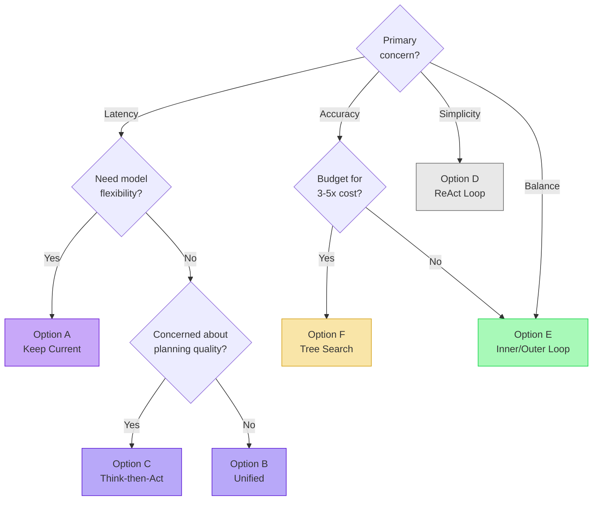

---

## Summary Table

| | A: Current | B: Unified | C: Think-Act | D: ReAct | E: Inner/Outer | F: Tree Search |
|---|---|---|---|---|---|---|
| **LLM calls/step** | 2-4 | 1-3 | 1-3 | 1/action | 1 + amortized | 4-7 |
| **Latency** | Baseline | -40% | -40% | Low/action | -30% | +200% |
| **Token cost** | Baseline | -20% | -10% | +50%* | -25% | +300% |
| **Accuracy (est.)** | 50-60% | 50-55% | 55-60% | 30-45% | 55-65% | 65-80% |
| **Model flexibility** | Yes | No | No | No | Partial | Yes |
| **Debuggability** | High | Low | Medium | Low | Medium | High |
| **Implementation** | Exists | 2-3 days | 2-3 days | 3-4 days | 3-4 days | 1-2 weeks |
| **Research support** | Agent-E | Browser-Use, LaVague | Plan-and-Act, ADaPT | ReAct (baseline) | Magentic-One | WebOperator |

*\* ReAct token cost grows quadratically with task length due to conversation history accumulation.*

---

## Recommendation

**Option E (Inner/Outer Loop)** offers the best balance for a general-purpose browser agent:

1. **Merges Oracle + Orchestrator** into a single outer-loop agent — less code, fewer serial calls, no more information loss between two separate advisory agents.
2. **Worker gains autonomy** to execute multiple steps between re-planning events — reduces latency by amortizing the planning cost.
3. **Worker gets richer context** — diff, guidance, avoid_ids flow directly to the Worker instead of being filtered through a single `worker_goal` string.
4. **Outer loop triggers align with existing Oracle triggers** — the periodic check and stuck detection logic already exist and are well-tuned.
5. **Preserves model flexibility** — different models for outer loop (strategic, can be stronger) vs inner loop (tactical, can be cheaper/faster).
6. **Research-backed** by Magentic-One architecture and the ADaPT framework.
7. **Incremental implementation** — can be built on top of the existing codebase by modifying the run loop trigger logic and merging the Oracle + Orchestrator prompts, without rewriting the Worker or Filter.

**Second choice: Option C** if simplicity is preferred over the complexity of managing sub-goal state. It gives the same latency win as Option B but with better debuggability via the enforced plan field.
