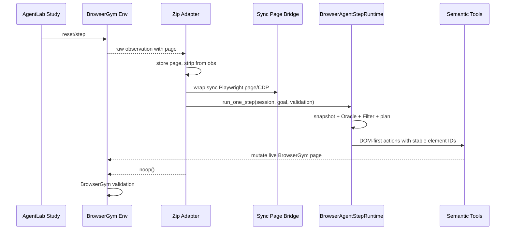
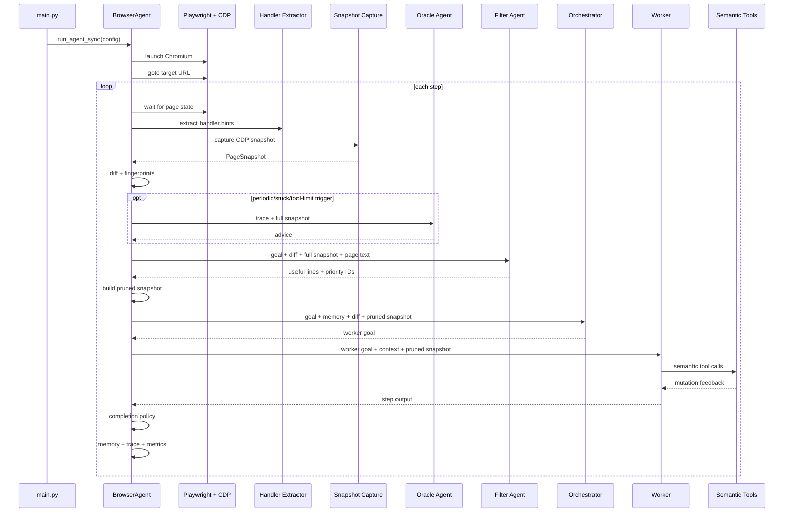

# Current Architecture

This document describes Zip's current code path, not the historical harness. It is verified against `main.py`, `src/agent/core/agent.py`, `src/agent/context/snapshot.py`, `src/agent/tools/semantic.py`, and `src/agent/prompts/system.py`.

## Runtime Entry

`main.py` defines the CLI and builds three configuration objects:

- `AgentConfig` for run settings, snapshot behavior, logging, metrics, Oracle timing, pruning, and unified mode.
- `LLMConfig` for provider, model, per-role model overrides, timeouts, retries, and max tokens.
- `BrowserConfig` for browser settings such as headless mode and viewport size.

It then calls `run_agent_sync()`, which creates a `BrowserAgent` and runs the async loop.

## AgentLab Entry

`benchmarks/agentlab/computer_use_agent.py` adds Zip's benchmark entry path for AgentLab and BrowserGym. `ComputerUseAgentArgs` and `ComputerUseAgentLabAgent` are legacy internal class names for the Zip adapter. The adapter sets `use_raw_page_output=True` and uses BrowserGym's raw `obs["page"]` instead of launching a browser.

`obs_preprocessor()` stores the raw Playwright page on the agent, converts any BrowserGym reward/termination fields into a `ValidationSignal`, and removes the page before AgentLab pickles step data. `get_action()` wraps the BrowserGym sync page with `src/agent/browser/external.py`, runs one `BrowserAgentStepRuntime` step with the latest validation signal, then returns `noop()` so BrowserGym can observe and validate the page that Zip already mutated.

This path deliberately keeps BrowserGym as the source of truth for success. Positive terminal BrowserGym validation stops as success; terminal zero/negative validation stops as failure. Internal `done=True` is only a proposal; while BrowserGym validation is still non-terminal, model completion is converted into a recovery attempt instead of latching the runtime as done.

## Main Loop

The default loop follows this order each step:

1. Wait for `domcontentloaded` and `networkidle` where possible.
2. Optionally extract JS handler hints.
3. Optionally mark scroll containers.
4. Capture a CDP snapshot.
5. Clean up temporary handler and scroll attributes.
6. Apply benchmark-specific recovery checks if their page signatures are detected.
7. Emit snapshot and CDP timing metrics.
8. Compute snapshot diff and fingerprints.
9. Check unchanged/stuck thresholds.
10. Build the full LLM-facing snapshot text.
11. Call Oracle if triggered.
12. Call Filter when the page fingerprint changes or the filter cache is invalidated.
13. Build a pruned snapshot with deterministic guardrails.
14. Run either the default Orchestrator -> Worker path or the `--unified` path.
15. Run the completion policy against external validation, `done=true` proposals, observable tool/page evidence, progress state, and tool-limit state.
16. Update compact memory, trace, metrics, and stop conditions.

## Snapshot Capture

`capture_snapshot()` in `src/agent/context/snapshot.py` uses CDP calls:

- `DOMSnapshot.captureSnapshot`
- `Accessibility.getFullAXTree`
- `Page.getFrameTree`

The snapshot includes interactive elements, selected non-interactive structural/text signals, raw text lines, frame metadata, accessibility data, bounding boxes, attributes, handler hints, descendant-text previews for unlabeled containers, context hints for labels/tables/nearby text, and widget hints for values, drag handles, and geometry.

Stable element IDs use an `el_` prefix and are derived from hashed snapshot/backend information. The LLM sees these IDs; internal CDP node IDs stay inside the tool layer.

## Handler Hints

`extract_handlers()` in `src/agent/context/handlers.py` runs one page evaluation before snapshot capture. It extracts short handler summaries from:

- Inline event handlers.
- React props and fiber/internal instance data.
- Vue 2 and Vue 3 internals.
- Angular context data.

Elements are temporarily stamped with `data-agent-hid` so the CDP snapshot can correlate DOM nodes with handler hints. Cleanup runs after snapshot capture.

In the LLM snapshot, hints appear like `[click:handleSubmit(); change:validate()]`.

## Oracle

The Oracle is a diagnostic advisor. It is called when any of these are true:

- The periodic interval fires.
- No-progress steps reach the stuck threshold.
- Consecutive worker steps hit the tool-call limit.

It receives the overall goal, progress metadata, recent step trace, worker tool list, and the full interactive snapshot tree. It returns `OracleAdvice` with:

- `all_clear`
- `diagnosis`
- `recommendation`
- `avoid`

When `all_clear` is false, the runtime creates an Oracle directive, invalidates the filter cache, extracts avoided stable IDs, and can widen the pruned snapshot depending on `widen_on_oracle`.

## Filter

The Filter is a conservative snapshot pruner. It receives:

- Overall goal.
- Last worker goal and summary.
- Diff since the previous snapshot.
- Oracle advice when present.
- Full interactive element tree.
- Selected raw page text lines.

It returns `SnapshotFilterOutput` with useful text lines and priority element IDs. The runtime then applies deterministic guardrails:

- Validate priority IDs against the current snapshot.
- Remove Oracle avoid IDs.
- Anchor phrases from useful text and Oracle hints to matching elements.
- Always include newly enabled elements.
- Expand kept containers to include nearby/sibling controls.
- Fall back to all non-avoided elements if pruning would keep nothing.

## Orchestrator And Worker

The Orchestrator sees the goal, useful lines, diff, compact runtime state, worker tool list, pruned snapshot, and Oracle directive. It returns an `OrchestratorDecision` with a small `worker_goal`. If it marks the overall goal complete, it must include `completion_evidence`; the runtime still validates that proposal before stopping.

The Worker receives:

- The delegated goal.
- Compact runtime state: last distinct page state, last unique action attempts, latest validation, recovery state, and blocked reason.
- Page context from filtered useful lines.
- The pruned page snapshot.

The Worker can only use the default worker tool set and returns `StepOutput`. A worker `done=true` only means the delegated worker goal is complete. The run continues until the Orchestrator or Unified agent marks the overall goal complete and the completion policy accepts it, or another stop condition fires.

## Unified Mode

`--unified` keeps snapshot capture, Oracle, Filter, pruning, tools, metrics, and memory, but replaces the Orchestrator -> Worker handoff with a single tool-equipped agent. The unified agent returns `UnifiedStepOutput`, where `done=true` means the overall run goal is complete. It must provide `completion_evidence`; naked `done=true` without external success or observable evidence becomes one recovery attempt and then a blocked stop. In BrowserGym runs, non-terminal validation also prevents internal `done=true` from latching before the environment reports success.

This mode exists to test the tradeoff between separation of concerns and handoff overhead.

## Semantic Tools

The default worker tool set is defined by `DEFAULT_WORKER_TOOLS` in `src/agent/core/agent.py`.

Default tools:

- `click_element`
- `click_at`
- `focus_element`
- `hover_element`
- `type_text`
- `transfer_text`
- `drag_and_drop`
- `pointer_drag`
- `set_slider_value`
- `resize_element`
- `draw`
- `select_text`
- `apply_format`
- `read_live_text`
- `scroll`
- `wait`
- `watch_for_text`
- `switch_to_iframe`
- `switch_to_main_frame`
- `press_key_combination`

The tool implementation lives in `src/agent/tools/semantic.py`. Many tools inject a MutationObserver before action execution and return feedback after a settle period. Tool wrappers persist compact structured facts such as DOM/value/URL/focus changes and block repeated identical no-change calls in the current page state after two attempts.

## Observability

Every run gets a run ID and writes artifacts to `logs/<run_id>/`:

- `agent.log`
- `agent_debug.log`
- `metrics.jsonl`
- `run_summary.json`
- Optional `pages/` captures when `--save-pages` is enabled.

The runtime emits metrics for run start/end, snapshot capture, handler extraction, CDP calls, agent calls, tool calls, and step ends.

## Benchmark-Specific Recovery Code

The current loop contains recovery code for known bugs from the external benchmark site:

- Stale React puzzle state after back-to-back puzzle steps.
- Recursive iframe challenge off-by-one behavior.
- Final-step code-reveal behavior.

These are intentionally documented as benchmark-specific. They should not be presented as general browser-agent architecture, and they should be isolated if this becomes a reusable package.

## Single-Step Runtime

`src/agent/core/step_runtime.py` contains the reusable single-step runtime used by the AgentLab adapter. It mirrors the main loop's per-step behavior: page settlement, handler extraction, scroll-container marking, CDP snapshot capture, diffs/fingerprints, Oracle, Filter, pruned snapshot construction, Orchestrator/Worker or Unified execution, completion policy, compact trace, metrics, and run summaries.

Unlike `BrowserAgent.run()`, it does not launch, navigate, or close the browser. The caller supplies an `ExternalBrowserSession`, and only CDP sessions created for the step are detached afterward.
